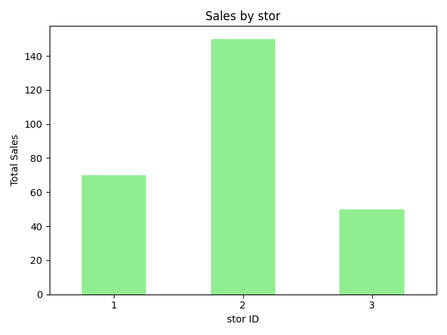
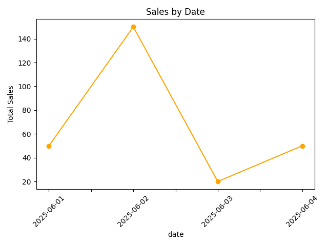

# ETL-Sales-Analysis

This project demonstrates a complete ETL (Extract, Transform, Load) pipeline using Python.

## Overview

The ETL process includes:

- **Extraction**: Reading raw sales, customers, products, employees, stores, and regions data from CSV files.
- **Cleaning**: Handling missing values, correcting invalid entries, and standardizing data.
- **Merging**: Combining datasets to create a unified view of sales transactions with customer details.
- **Analysis**: Generating insights like total sales, sales by gender, product, store, and date.
- **Visualization**: Creating charts using `matplotlib`:
### Sales by Gender

*This bar chart shows the total sales amounts split by gender.*

### Sales by Product

*This bar chart displays total sales per product.*

### Sales by Store

*This bar chart shows sales distribution across stores.*

### Sales by Date

*This line chart illustrates sales trends over time.*

## Project Structure

ETL-Py project/
├── raw_data/
│ ├── Customers.csv
│ ├── Employees.csv
│ ├── Products.csv
│ ├── Regions.csv
│ ├── Sales.csv
│ └── Stores.csv
├── cleaned_data/
│ └── cleaned_Stores.csv
├── merged_data/
│ └── merged_sales_customers.csv
├── scripts/
│ └── etl_project.py
├── Visualization/
│ └── (chart images)
├── requirements.txt

## How to Run

1. Clone the repository.
2. Install dependencies:
   pip install -r requirements.txt
   [Download requirements.txt](https://github.com/iias99/ETL-Sales-Analysis/blob/main/requirements.txt)

4. Run the script:
   python scripts/etl_project.py
 ## Author

[Asrar Alshahrani]  
